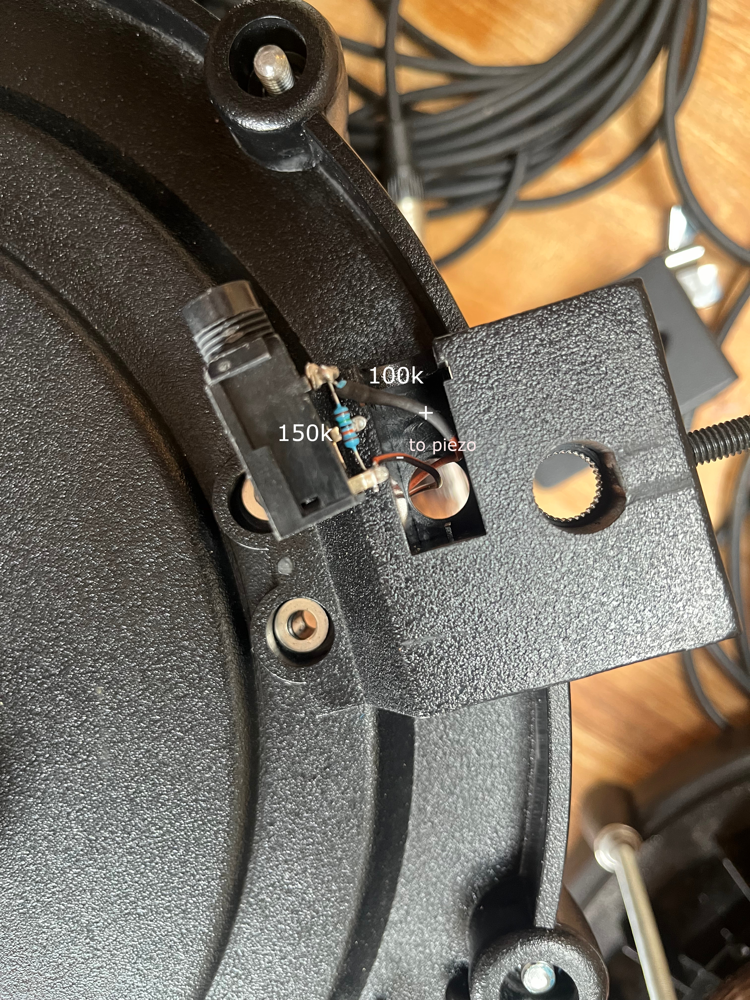

# OrchLab Timpani Drum Brain

This drum brain was developed as part of [OrchLab](https://orchlab.org/), a collaboration between the [London Philharmonic Orchestra](https://lpo.org.uk/) and [Drake Music](https://www.drakemusic.org/) to create accessible orchestral instruments. The goal is to provide a pair of accessible kettledrums (timpani) that can be played by musicians with varying physical abilities while maintaining the expressive qualities and professional sound expected in an orchestral setting.

The system is built on Teensy 4.0 with audio shield, featuring real-time wavetable synthesis and an intuitive OLED interface.

## Features

### Audio Processing
- **Wavetable synthesis** using Teensy Audio Library for realistic timpani sounds
- **Velocity-sensitive playback** responding to hit dynamics
- **Independent MIDI note assignment** per drum (pitch shifting from single sample set)
- **Master volume control** via potentiometer with real-time feedback
- **Dual-channel audio output** through Teensy Audio Shield (SGTL5000)

### Drum Triggering
- **Peak detection algorithm** for accurate hit capture
- **Hardware sensitivity control** via trim pot on each conditioning board
- **Scan time and mask time** protection against double-triggering
- **Support for two independent drum inputs**

### User Interface
- **128x64 OLED display** (I2C on bus 1) with multiple screens:
  - Idle screen with hit indicators
  - Menu system for MIDI note selection
  - Volume overlay
- **Five-button control** (directional cross + center button)
- **One potentiometer**: master volume

### Data Persistence
- **EEPROM storage** for MIDI note assignments
- **Delayed write protection** (30-second delay after last change)
- **Configuration validation** with magic number check
- **Automatic fallback** to default values on corrupted data

## Hardware Requirements

### Core Components
- **Teensy 4.0** microcontroller
- **Teensy Audio Shield** (Rev D with SGTL5000)
- **128x64 OLED display** (SSD1306, I2C)
- **Two Alesis mesh head drum pads** (12")

### Control Interface
- **5x tact switches** (directional cross layout)
- **1x potentiometer** (master volume)
- **2x trim pots** (one per drum, mounted on conditioning boards)

## Signal Conditioning Circuit

Each drum channel uses a dedicated conditioning board to prepare the piezo signal before it reaches the Teensy ADC.

### Inside the Drum (Alesis Pad)

The piezo wiring inside the Alesis pad is reversed so that the dominant negative spike becomes a positive signal. The internal resistor network (100k series resistor R6 and 150k pull-down R7) acts as a voltage divider and must be retained — it is critical to signal sensitivity.


*Internal piezo circuit — note reversed polarity wiring*



### External Conditioning Board

One board per drum processes the signal through the following stages:

1. **Clamp diodes (D1, D2)** — 1N4148 diodes clamp the input to the supply rails, protecting the op-amp from voltage spikes
2. **Buffer (U1A)** — unity-gain buffer isolates the piezo source impedance from the rest of the circuit
3. **Gain stage (U1B + RV1)** — non-inverting amplifier with a 100k trim pot (RV1) to set gain; this is the hardware sensitivity control, one per drum
4. **Peak detector (D3, C2, R5)** — captures and holds the peak of the strike transient for reliable ADC sampling


*Per-channel signal conditioning circuit*

Software sensitivity adjustment has been removed. Sensitivity is set entirely in hardware via RV1 on each conditioning board.

The KiCad schematic and board files for the conditioning circuit are available at [github.com/gawainhewitt/piezo_signal_conditioner](https://github.com/gawainhewitt/piezo_signal_conditioner).

### Pin Assignments

| Component | Pin | Notes |
|-----------|-----|-------|
| Drum 1 (Piezo) | A0 | Via conditioning board |
| Drum 2 (Piezo) | A1 | Via conditioning board |
| Pot (Volume) | A12 | 0-3.3V range |
| Button UP | 9 | Active LOW |
| Button LEFT | 4 | Active LOW |
| Button CENTER | 2 | Active LOW |
| Button RIGHT | 5 | Active LOW |
| Button DOWN | 3 | Active LOW |
| OLED SDA | 18 (SDA1) | I2C Bus 1 |
| OLED SCL | 19 (SCL1) | I2C Bus 1 |

## Software Architecture

The project follows a modular, object-oriented design with clear separation of concerns:

### Core Classes

#### `DrumTrigger` (`drum_trigger.h/cpp`)
Handles piezo sensor input processing with peak detection algorithm:
- Threshold-based trigger detection
- Scan window for peak capture
- Mask time to prevent double-triggering

#### `AudioManager` (`audio_manager.h/cpp`)
Manages audio synthesis and playback:
- Dual wavetable synthesizer instances
- Mixer for channel management
- MIDI note-based pitch shifting
- Volume control and velocity mapping
- Embedded timpani sample data

#### `DisplayManager` (`display_manager.h/cpp`)
Handles all OLED rendering using custom I2C bus 1 library:
- Splash screen
- Idle screen with hit indicators
- Menu system display
- Volume overlay
- Real-time hit dot animations

#### `InputControls` (`input_controls.h/cpp`)
Manages all user input devices:
- Button debouncing and press detection
- Potentiometer reading with change detection
- Noise filtering on analog inputs

#### `MenuSystem` (`menu_system.h/cpp`)
Implements the note selection interface:
- MIDI note range (C2-C4, notes 36-60)
- Per-drum note selection
- Auto-timeout after 15 seconds
- Dirty flag tracking for EEPROM writes

#### `EEPROMManager` (`eeprom_manager.h/cpp`)
Handles persistent configuration storage:
- Delayed write protection (30 seconds)
- Data validation with magic number
- Atomic read/write operations

### Audio Sample Format

The system uses the `simpletimp` instrument data, a soundfont-derived wavetable format compatible with the Teensy Audio Library. Samples are embedded in flash memory to avoid SPI bus interference from SD card operations — SD card activity caused continuous false triggering on analog inputs, so flash embedding was the chosen solution.

## Installation

### Prerequisites

- **PlatformIO** (VSCode extension or CLI)
- **Teensy 4.0 board definitions**
- **Custom U8g2 library fork** for I2C bus 1 support

### Build and Upload

1. Clone the repository:
```bash
git clone <repository-url>
cd orchlab-timpani
```

2. Build and upload:
```bash
pio run --target upload
```

3. Monitor serial output (optional):
```bash
pio device monitor
```

### Library Dependencies

The project uses a custom fork of U8g2 that enables I2C bus 1 functionality:
```ini
lib_deps = 
    https://github.com/gawainhewitt/bus1_U8g2
```

This is necessary because the standard U8g2 library only supports I2C bus 0, which conflicts with the Teensy Audio Shield.

## Configuration

### Default Settings

Defined in `config.h`:

| Parameter | Default | Description |
|-----------|---------|-------------|
| `THRESHOLD` | 50 | Minimum ADC value to start trigger scan |
| `TRIGGER_VALUE` | 100 | Fixed trigger threshold (sensitivity set in hardware) |
| `SCAN_TIME` | 5 ms | Window to capture peak value |
| `MASK_TIME` | 50 ms | Dead time after trigger to prevent double-hits |
| `DEFAULT_DRUM1_NOTE` | 36 (C2) | Initial MIDI note for drum 1 |
| `DEFAULT_DRUM2_NOTE` | 43 (G2) | Initial MIDI note for drum 2 |

### MIDI Note Range

The menu system provides access to MIDI notes 36–60 (C2 through C4), covering a two-octave range suitable for timpani voicing. Notes are displayed in standard musical notation (e.g., "C2", "F#3").

## Usage

### Initial Startup

1. Power on the system
2. Wait for splash screen (2 seconds)
3. System enters idle mode showing two drum indicators
4. Hit drums to trigger sounds with visual feedback

### Adjusting Volume

- Turn the volume potentiometer
- Volume overlay displays for 3 seconds
- Changes apply immediately

### Adjusting Sensitivity

Sensitivity is adjusted physically using the RV1 trim pot on each drum's conditioning board. No software adjustment is required or available.

### Changing MIDI Notes

1. Press **CENTER** button to enter menu
2. Use **LEFT/RIGHT** to switch between drums
3. Use **UP/DOWN** to adjust MIDI note
4. Hit drums to preview sound while in menu
5. Press **CENTER** again to exit, or wait 15 seconds for auto-timeout
6. Changes are saved to EEPROM after 30 seconds of inactivity

### Hit Indicators

- Solid dots appear on idle screen when drums are hit
- Dots remain visible for 250ms
- Works in both idle and menu modes

## Technical Details

### Trigger Algorithm

1. **Threshold detection** — monitors analog input for values exceeding `THRESHOLD`
2. **Scan window** — captures peak value over `SCAN_TIME` period
3. **Mask period** — ignores input for `MASK_TIME` to prevent retriggering

### Audio Processing Pipeline

```
Piezo Input → Conditioning Board → ADC (12-bit) → Peak Detection → 
Velocity Scaling → Wavetable Synth → MIDI Pitch Shift → Mixer → 
I2S DAC → Audio Output
```

### Display Update Strategy

The display updates at approximately 20Hz (every 50ms). States are managed by a finite state machine:

- `STATE_IDLE` — normal operation showing hit dots
- `STATE_VOLUME_OVERLAY` — temporary volume display (3s timeout)
- `STATE_MENU` — note selection interface (15s timeout)

### EEPROM Write Protection

Writes are delayed by 30 seconds after the last configuration change to protect EEPROM lifespan from rapid successive writes.

## Serial Monitor Output

115200 baud via USB serial:

```
Loaded notes from EEPROM
Drum 1: C2 (MIDI 36) | Drum 2: G2 (MIDI 43)
Drum trigger system ready!
Hit the drums or press CENTER to enter menu...
Volume: 0.75
```

## Troubleshooting

### No Sound Output
- Verify audio shield is properly seated
- Check SGTL5000 initialisation in serial monitor
- Confirm headphone/line out connections
- Check master volume pot

### False Triggering
- Check conditioning board connections
- Adjust RV1 trim pot on the relevant drum's conditioning board (reduce gain)
- Ensure proper grounding throughout

### Display Not Working
- Confirm OLED is on I2C bus 1 (pins 18/19, not 16/17)
- Check bus1_U8g2 library is properly installed
- Verify I2C address (typically 0x3C)

### Notes Not Saving
- Wait 30 seconds after last change before power-off
- Check serial output for EEPROM write confirmation

## Future Enhancements

- [ ] Additional drum inputs
- [ ] MIDI output for external sound modules
- [ ] Per-drum envelope shaping
- [ ] Reverb and effects processing
- [ ] Configuration presets

## Credits

**Hardware**: Teensy 4.0, PJRC Audio Shield Rev D  
**Display Library**: Custom U8g2 fork for I2C bus 1 support  
**Audio Library**: Teensy Audio Library by Paul Stoffregen  
**Samples**: SimpleTimpani soundfont, derived from timpani sound by Shōtotsu ([CC0 License](https://creativecommons.org/publicdomain/zero/1.0/))  
**Original Sound**: https://freesound.org/people/Sh%C5%8Dtotsu/sounds/688793/

## License

This project is licensed under the MIT License - see the [LICENSE](LICENSE) file for details.

## Author

Gawain Hewitt